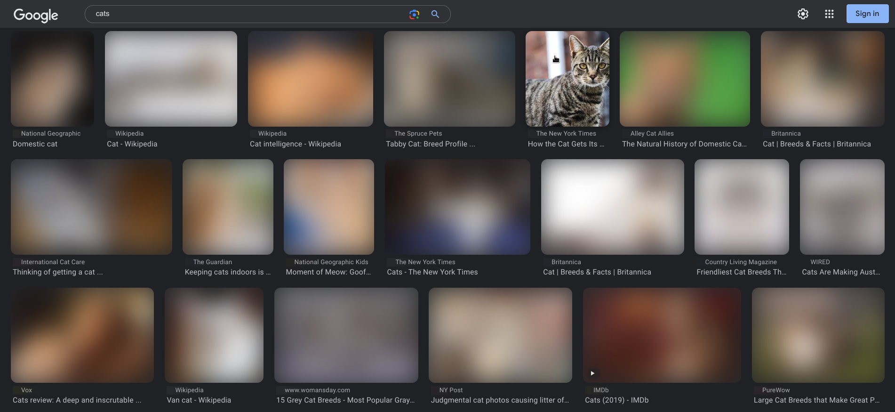

# Image Blurrer
This extension blurs all HTML img tags on pages and has an option to reveal the image on hover. Created for fun.

Compatible with Google Chrome, Mozilla Firefox, Microsoft Edge.
Manifest version 3.



## How to install
### Google Chrome
1. Go to the Extensions page by entering chrome://extensions in a new tab.
    - Alternatively, click on the Extensions menu puzzle button and select Manage Extensions at the bottom of the menu.
    - Or, click the Chrome menu, hover over More Tools, then select Extensions.
2. Enable Developer Mode by clicking the toggle switch next to Developer mode.
3. Click the "Load unpacked" button and select the extension directory.

### Mozilla Firefox
**Note**: Change the background key in the manifest.json file as follows:
```
...
"background": {
    "scripts": ["scripts/service-worker.js"]
},
...
```
This is necessary because Firefox does not support service workers in MV3 yet.

1. Open the debugging page by entering about:debugging in a new tab.
2. Click the "This Firefox" option.
3. Click the "Load Temporary Add-on" button and then select manifest file in extension directory.
4. Go to the Extensions page by entering about:addons in a new tab.
    - Alternatively, click on the Extensions menu puzzle button and select Manage Extensions at the bottom of the menu.
    - Or, click the Firefox menu, then select "Add-ons and themes".
5. Select Image Blurrer extension.
6. Click the permissions button and allow "Access your data for all websites" by clicking the toggle switch.

### Microsoft Edge
1. Go to the Extensions page by entering edge://extensions in a new tab.
    - Alternatively, click the Edge menu and select Extensions. The Extensions pop-up box opens. Click "Manage extensions".
2. Turn on the Developer mode toggle.
3. Click the "Load unpacked" button and select the extension directory.